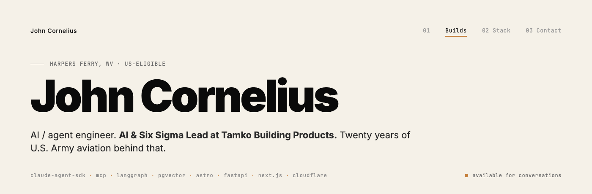

  

### Currently building

**[portfolio-2026](https://github.com/corn8200/portfolio-2026)** — Astro 5 SSR portfolio on Cloudflare Pages. Custom WebGL2 fragment-shader hero (~250 lines of GLSL, no Three.js), OpenAI Realtime voice agent, RAG over CV via Cloudflare Vectorize. Live → [portfolio-2026-123.pages.dev](https://portfolio-2026-123.pages.dev).

**[agent-core](https://github.com/corn8200/agent-core)** — Personal Claude Agent SDK automation hub: named agent personas (Scout, Forge, Wrench, Dispatch, Ledger, Toolsmith, Titan, Anvil, Critic), MCP tool surface, approval outbox, pgvector recall.

**[mcp-bridge](https://github.com/corn8200/mcp-bridge)** — Local OAuth-aware bridge for Model Context Protocol servers. Stable HTTP endpoint, warm token cache, automatic reconnect with backoff, CORS allowlist for Claude / ChatGPT origins.

**[pane-commander](https://github.com/corn8200/pane-commander)** — Stateless LangGraph orchestrator for a fleet of Claude Code CLI panes in tmux. Pure-observe watchers, idempotent dispatch sequence keys, K8s-style conditions.

**[anthropic-update-watcher](https://github.com/corn8200/anthropic-update-watcher)** — Multi-agent Claude swarm that classifies each day's AI-platform releases against your codebase and emails a digest of what actually matters.

**[prepper](https://github.com/corn8200/prepper)** — Personal alert aggregator: NWS + USGS + news → LLM classifier → email/Pushover. GitHub Actions automation, ops-grade reliability.

**[weather-fusion](https://github.com/corn8200/weather-fusion)** — Twice-daily NOAA forecast emailer. GRIB2 parsing, multi-source ensemble, HTML email with CSV/PNG artifacts.

---

### Stack

---

### Talk to me

[**portfolio-2026-123.pages.dev**](https://portfolio-2026-123.pages.dev) &nbsp;·&nbsp; voice agent will pitch the long version

---

  
  

